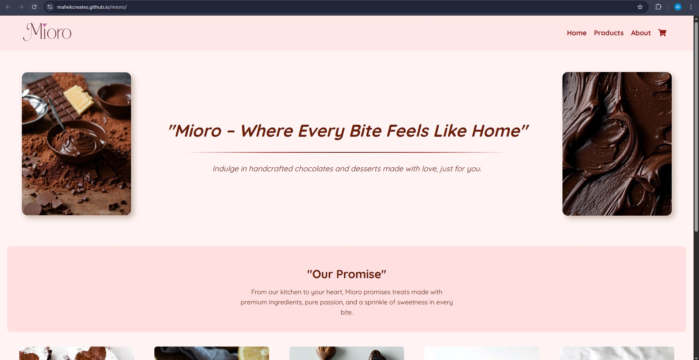
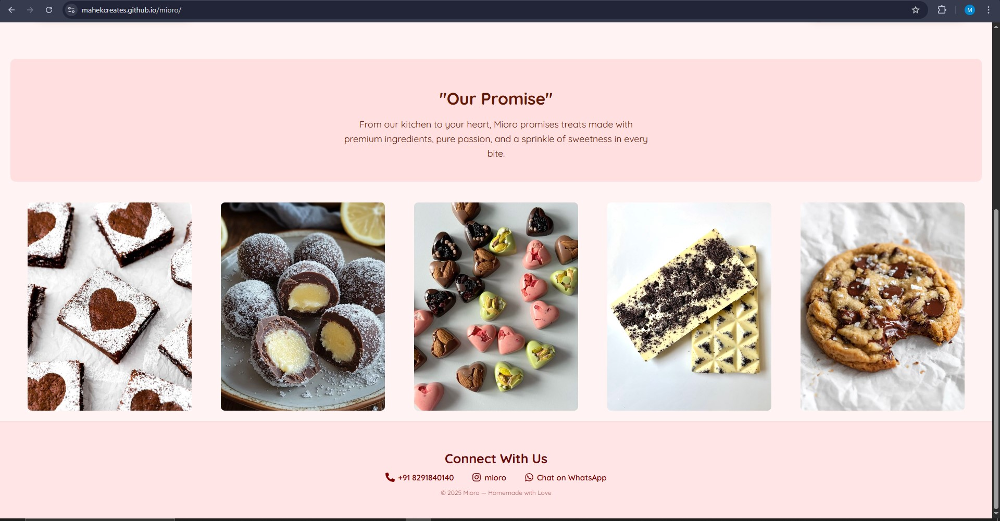
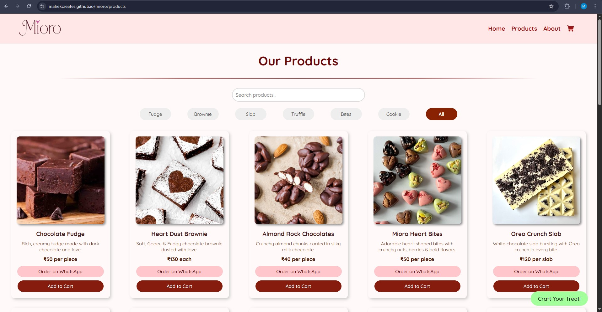
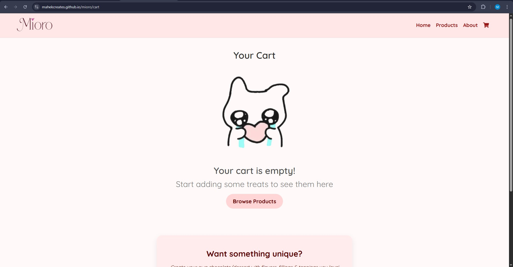
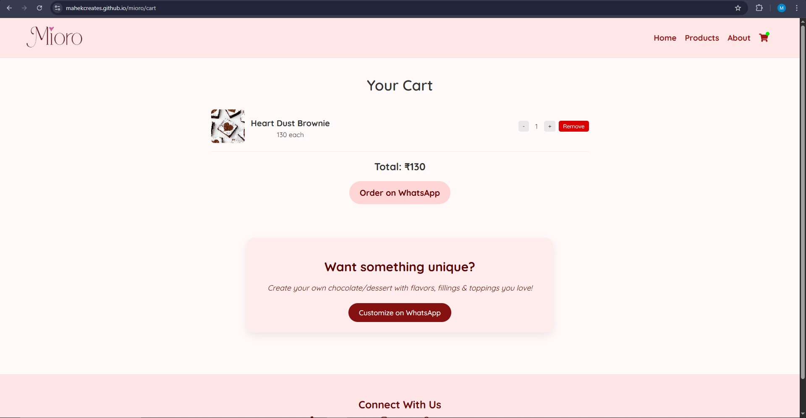
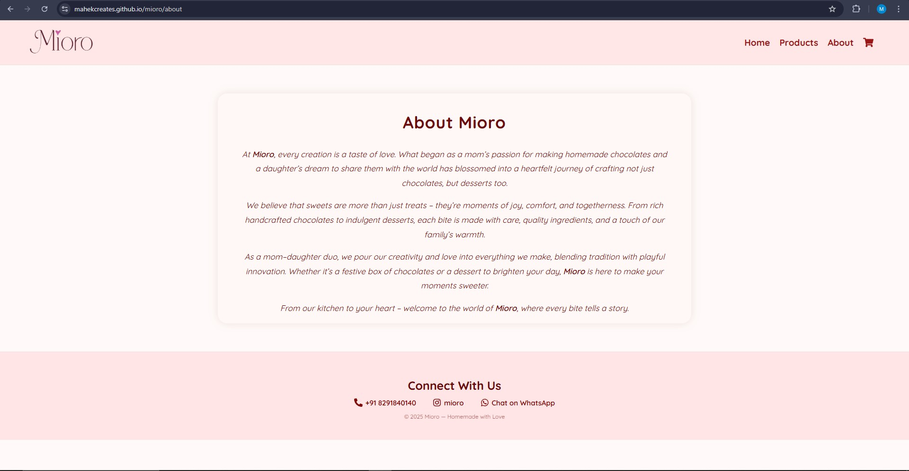

# Mioro – Handmade Chocolate & Desserts Website

## Website Link
Check out the website here: [Mioro Website](https://mahekcreates.github.io/mioro)

## Description
Mioro is a responsive, visually rich website for a homemade chocolate and dessert business.  
It allows users to browse products, filter by category, search, and order via WhatsApp.  
This project demonstrates modern frontend development with React.js, CSS, and local storage for cart functionality.

## Features
- Responsive Design – Works on desktop and mobile  
- Product Filtering & Search  
- Order via WhatsApp  
- Add to Cart Functionality  
- Custom Treat Section  

## Technologies Used
React.js, HTML, CSS, JSX, useState, localStorage, Vite.js, Git & GitHub  

## Screenshots
### Home Page

### Products Page

### Cart Page

### About Page

## Author
**Mahek Katwala** – Software Development Student  
[GitHub Profile](https://github.com/mahekCreates)
